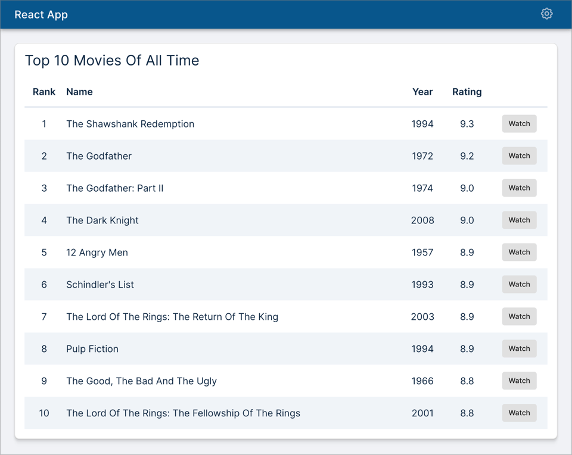

# Flexible React Stack

This guide will help you build your React app without enforcing strong opinions.
For example, you will be able to choose between a classic React, Next.js, Remix
or any other framework of your choice. We all know how fast the front-end
landscape is changing. So instead of locking you into a specific stack, this
guide talks about the options available at each step and lets you decide what
you want to include in your stack.

Another advantage of this approach is that you know exactly what your stack
contains. When that new shiny technology comes along, you are in a better
position to slot it in!

As we build our stack, we will also build the following sample app in parallel.



For a quick test drive of the final application, follow the instructions below
for a development build or a production build.

## Development Build

```bash
npm install
npm run dev
```

Open browser windows at each of the following URLs to see the respective demo
apps:

1. http://localhost:3000/: Movie Magic | React
2. http://localhost:3001/: Movie Magic | Next.js (not stated)
3. http://localhost:3002/: Movie Magic | Remix (not started)

Note that the React app fetches mock data from MSW, whereas the other two apps
fetch real data from the movie-magic-api.

> Note: Do not run `npm install` in any of the subdirectories. It will break the
> build. There should be only one `package-lock.json` file in the entire repo
> (at the root).

## Production Build

To build all apps and packages, run the following command:

```bash
npm install
npm run build
```

## Running Storybook

```bash
cd storybook
npm install
npm run storybook  # you can also run it from the root directory
```

## Running Unit Tests

```bash
npm run test
```

## Running End-to-End Tests

```sh
npm run dev # starts a local server hosting the react app

# run cypress in a different shell
npm run cypress
```

## Code Formatting

```sh
npm run format
```

## TODO

- Update dependencies on `@storybook/react` from `next` to the latest version
  when [this Storybook PR](https://github.com/storybookjs/storybook/pull/17215)
  gets merged (add support for React 18).
- Take out overrides of react and react-dom in `/package.json` when version 18
  is automatically hoisted instead of version 17.
