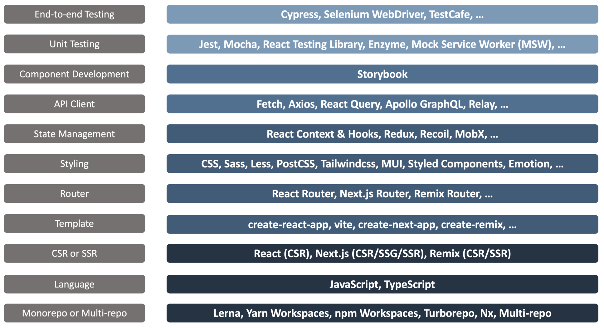
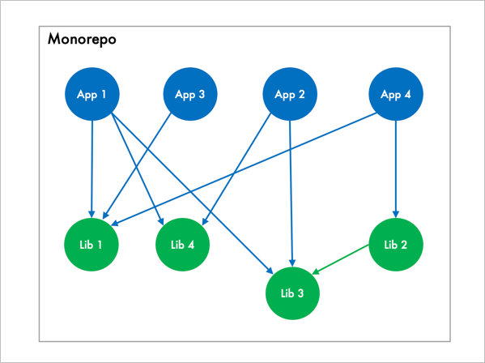
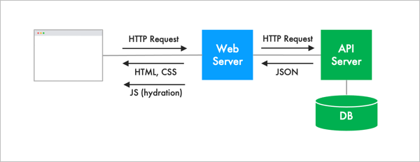

# Custom React Stack

React has a very rich ecosystem. For anything you want to do, there is probably
a library or a framework available for it. That's great, but having too many
options can also be very confusing. Do you want to start out simple or go for
the ultimate because your app demands it? What's the right set of options for
your specific use case?

This guide will help you build your own custom React stack, explaining key
options and tradeoffs at each step.

Another advantage of this approach is that you will know exactly what's in your
stack. When that new shiny technology comes along, you will be in a better
position to slot it in.

## Our Sample App: Movie Magic

For the purpose of this discussion, imagine that you want to write a movie
streaming app - _Movie Magic_. The app should present the available movie titles
and help users make a choice. It should also allow them to manage their
subscriptions.

Here's a very humble beginning, just two pages:

1. A Home page showing the list of top 10 movies:


2. A Settings page for users to manage their subscription:


Click [here](https://custom-react-stack.vercel.app/) to test drive the final
application. As you can see, it doesn't do much yet. However, this is good
enough for the purpose of our discussion. Let's start by discussing our
architecture choices.

## Tech Stack Options

The diagram below shows the key items that make up our tech stack, along with
some options. Subsequent sections will discuss the pros & cons of each option.
Note that the diagram is meant to be read bottom up - imagine that we are
building a stack.



## Monorepo vs. Multi-repo

For a really simple app, you can just create a single Git repo and call it a
day. But what if you want to separate out reusable components into a library?
Well, you can create a separate repo for it and put the compiled output in a
binary repository (such as npm or Artifactory). See below. The app can pick up
the library from the binary repository by adding a dependency to it. This is
called a multi-repo set up (two repos in this case).


Continuing this scenario, what happens when you have multiple applications and
multiple libraries with complex dependencies on each other? Let's say we start
adding a new repo for each application and each library. This is now starting to
look ugly.


Here are some issues with the multi-repo approach:

- It is cumbersome to add new repos. You have to set up new tooling, new CI/CD
  pipelines, add committers, and the list goes on.
- You start to see duplicate code in your repos because people are reluctant to
  put in the effort to create a new repo just to reuse code. It is much easier
  to copy code from another repo.
- It is difficult to maintain consistent tooling across repos.

A solution that works better in such use cases is a monorepo.

> Monorepo is a single repository containing **multiple distinct projects**,
> with **well-defined relationships**.

Here's an example of taking the multiple repos in the above diagram and
replacing them with a single repo:



Here are the advantages of a monorepo:

- No overhead to create new projects
- Easy to refactor code for reuse
- Consistent way of building every project
- Bug fixes are available immediately to all dependent projects and can be
  tested exhaustively before committing
- Developers can confidently contribute to any project

You can build a monorepo manually by putting all your projects into one repo and
figuring out a way to organize and build them. However, people generally use an
off-the-shelf monorepo platform such as Lerna, Yarn Workspaces, npm Workspaces,
Turborepo or Nx.

Both Turborepo and Nx provide some very advanced features, but Turborepo is my
favorite because it is less opinionated - it builds on top of npm or Yarn
Workspaces. This approach allows me to integrate existing templates more easily
into my monorepo. Each project has its own `package.json` file, making it easy
to track why a particular dependency was added.

Nx, on the other hand, keeps the dependencies for all projects in a single giant
`package.json` sitting at the root. This helps maintain a _single version
policy_. However, this has its own pros & cons (you can google for opinions).
Note that
[Nx can be used in a bare-bones way without using Nx plugins](https://nx.dev/getting-started/nx-core).
In this mode, Nx simply builds on top of npm or Yarn Workspaces and becomes
equivalent to Turborepo.

## Language

JavaScript is one of the most popular programming languages in the world. It has
a huge community behind it and plenty of learning resources. For simple
applications, it works really well. However, as the complexity increases it is
easier to introduce bugs due to its weak type checking. If your application
deals with complex data structures, it is better to switch over to TypeScript
because of its static type checking. The TypeScript compiler will catch many
mistakes that will simply slip by JavaScript. TypeScript is also great for
defining conceptual models that are shared between backend and frontend teams.

## CSR vs. SSR

### Client-Side Rendering (CSR)


For simple applications (say with 10-20 pages) you can probably get away with a
Single Page App (SPA) where all the JavaScript is loaded in one shot and
thereafter all rendering takes place client-side. The client makes HTTP requests
to an API server to get any data it needs to render pages. This is called
Client-Side Rendering (CSR). This is also how classic React works.

CSR is simple to develop and simple to deploy (only a static bundle needs to be
deployed to your web server). It's perfect for simple applications. However, the
downside is that the initial render is slow because the entire JavaScript has to
be downloaded before rendering can happen. In technical terms, we have a slow
First Contentful Paint (FCP) and a slow Time to Interactive (TTI). If you are
building a marketing or eCommerce site your users may not have the patience to
wait for the app to load. If that's the case, you should consider SSR.

### Server-Side Rendering (SSR)



In Server-Side Rendering, as the user navigates through the site, the browser
makes requests to the web server to render individual pages. The web server must
connect to the API server and get the data it needs to render pages. It needs to
be smart to compose pages really fast and send them to the browser (unlike CSR,
where the server simply sends a pre-built static bundle to the browser). This
puts a lot more load on the web server. However, the advantage is that the
browser sees its First Contentful Paint (FCP) really fast. The Time to
Interactive (TTI) is still slow because interactions cannot start until the
JavaScript is also sent to the browser (a process called hydration). That's the
tradeoff.

Next.js and Remix are a two of the most popular Server-Side Rendering frameworks
in the React ecosystem.

## Movie Magic Tech Stack

Given the options discussed above, I decided to build Movie Magic using three
different stacks to illustrate the differences: Classic React, Next.js & Remix.
The chart below shows the decisions made within each stack.


## Movie Magic Repo Structure


## Building Movie Magic

### Development Build

```bash
npm install
npm run dev
```

Open browser windows at each of the following URLs to see the respective demo
apps:

1. http://localhost:3000/: Movie Magic | React
2. http://localhost:3001/: Movie Magic | Next.js
3. http://localhost:3002/: Movie Magic | Remix

Note that the React app fetches mock data from MSW, whereas the other two apps
fetch real data from the movie-magic-api.

> Note: Do not run `npm install` in any of the subdirectories. It will break the
> build. There should be only one `package-lock.json` file in the entire repo
> (at the root).

### Production Build

To build all apps and packages, run the following command:

```bash
npm install
npm run build
```

### Clean Build

Removes all build artifacts and performs a clean build.

```bash
npm run clean
npm install
npm run dev
```

For an "aggressive" clean build, add one more step as shown below. This wil
build the lock file from scratch.

```bash
npm run clean
rm package-lock.json
npm install
npm run dev
```

## Running Storybook

```bash
cd storybook
npm install
npm run storybook  # you can also run it from the root directory
```

## Running Unit Tests

```bash
npm run test
```

## Running End-to-End Tests

```sh
npm run dev # starts a local server hosting the react app

# run cypress in a different shell
npm run cypress
```

## Code Formatting

```sh
npm run format
```
